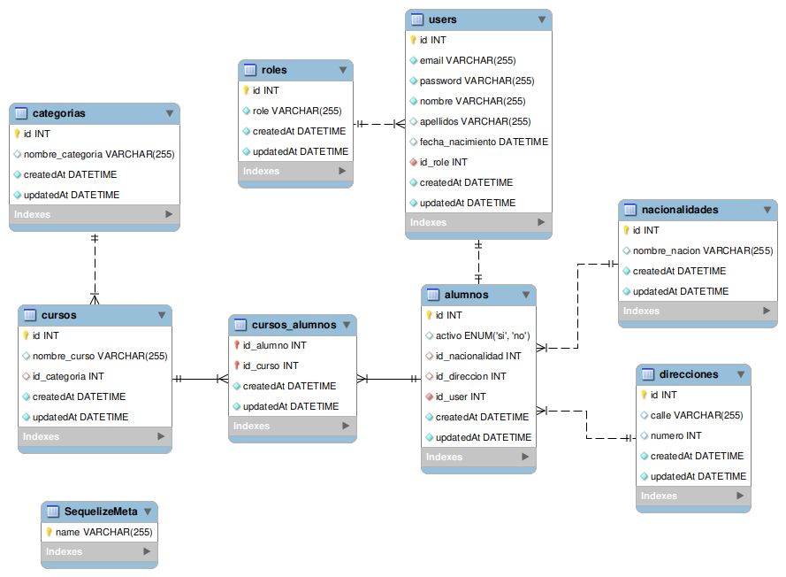

# Aplicación Backend API para gestión de alumnos

<details>
  <summary>Contenido 📝</summary>
  <ol>
    <li><a href="#objetivo">Objetivo</a></li>
    <li><a href="#sobre-el-proyecto">Sobre el proyecto</a></li>
    <li><a href="#deploy-🚀">Deploy</a></li>
    <li><a href="#stack">Stack</a></li>
    <li><a href="#diagrama-bd">Diagrama</a></li>
    <li><a href="#instalación-en-local">Instalación</a></li>
    <li><a href="#endpoints">Endpoints</a></li>
    <li><a href="#futuras-funcionalidades">Futuras funcionalidades</a></li>
    <li><a href="#contribuciones">Contribuciones</a></li>
    <li><a href="#contacto">Contacto</a></li>
  </ol>
</details>

## Objetivo
Este proyecto requería una API funcional conectada a una base de datos con al menos una relación de uno a muchos y una relación de muchos a muchos.

## Sobre el proyecto
Aplicación API de ejemplo para la gestión de una base de datos de alumnos. La gestión se realiza teniendo en cuenta los distintos tipos de roles (admin, user) y la autenticación basada en token.

## Deploy 🚀
<div align="center">
    <a href="https://www.google.com"><strong>Url a producción </strong></a>🚀🚀🚀
</div>

## Stack
Tecnologías utilizadas:
<div align="center">
<a href="https://sequelize.org/">
    
</a>
<a href="https://www.expressjs.com/">
    
</a>
<a href="https://nodejs.org/es/">
    
</a>
<a href="https://developer.mozilla.org/es/docs/Web/JavaScript">
    
</a>
 </div>


## Diagrama BD


## Instalación en local
1. Clonar el repositorio
2. ` $ npm install `
3. Conectamos nuestro repositorio con la base de datos 
4. ``` $ Ejecutamos las migraciones ``` 
5. ``` $ Ejecutamos los seeders ``` 
6. ``` $ npm run dev ``` 


## Endpoints
<details>
<summary>Endpoints</summary>

- AUTH
    - Registrar alumno

            POST http://localhost:3000/auth/register/alumno
        body:
        ``` js
            {
                "nombre" : "Bob",
                "apellidos": "Cooper",
                "email": "bob@cooper.com",
                "password": "12345678",
                "fecha_nacimiento": "2002-02-02",
                "activo": "si",
                "id_nacionalidad": 1,
                "id_direccion": 2
            }
        ```

    - Login

            POST http://localhost:3000/auth/login  
        body:
        ``` js
            {
                "email": "bob@cooper.com",
                "password": "12345678"
            }
        ```
- ALUMNOS
    - Obtener todos los alumnos  

            GET http://localhost:3000/api/alumnos?page=1

    - Obtener alumno por id  

            GET http://localhost:3000/api/alumnos/:id

    - Obtener alumnos por nombre  

            GET http://localhost:3000/api/alumnos/nombre/:name

    - Obtener perfil de alumno

            GET http://localhost:3000/api/alumnos/profile

    - Actualizar perfil de alumno

            PUT http://localhost:3000/api/alumnos/profile 
        body:
        ``` js
            {
                "apellidos": "Brown",
                "fecha_nacimiento": "2000-01-01",
                "password": "123456789"
            }
- USUARIOS
    - Obtener todos los usuarios (incluye alumnos)  

            GET http://localhost:3000/api/users?page=1
</details>

## Futuras funcionalidades
[ ] Añadir mas end-points para la gestión de usuarios (incluye alumnos)  
[ ] Añadir end-points para la gestión de cursos  
[ ] Añadir logs con winston  
[ ] Validaciones de la solicitud con express-validator  


## Contribuciones
Las sugerencias y aportaciones son siempre bienvenidas.  

Puedes hacerlo de dos maneras:

1. Abriendo una issue
2. Crea un fork del repositorio
    - Crea una nueva rama  
        ```
        $ git checkout -b feature/nombreUsuario-mejora
        ```
    - Haz un commit con tus cambios 
        ```
        $ git commit -m 'feat: mejora X cosa'
        ```
    - Haz push a la rama 
        ```
        $ git push origin feature/nombreUsuario-mejora
        ```
    - Abre una solicitud de Pull Request


## Contacto

<a href="https://www.linkedin.com/in/fidel-gilart-gilart/" target="_blank"></a> 
</p>